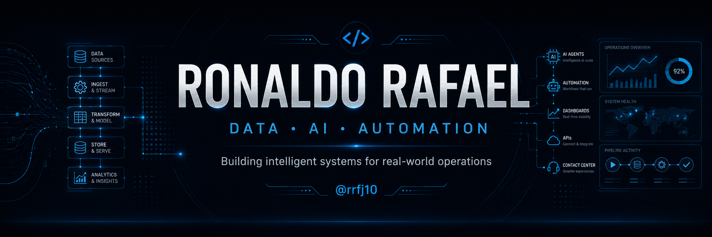

<!-- =========================================================
     RONALDO RAFAEL — GITHUB PROFILE
     github.com/rrfj10
========================================================= -->

<p align="center">
  
</p>

<br>

<h1 align="center">👋 Olá, eu sou Ronaldo Rafael</h1>

<h3 align="center">
  Data • AI • Automation • Analytics • Contact Center Technology
</h3>

<p align="center">
  Construindo soluções que conectam <strong>dados, inteligência artificial, automação e operações reais.</strong>
</p>

<p align="center">
  <a href="https://github.com/rrfj10">
    
  </a>
  
</p>

---

# 🚀 Sobre mim

Minha atuação está na interseção entre **negócio, tecnologia e operação**.

Trabalho desenvolvendo e estudando soluções para transformar grandes volumes de dados operacionais em **informação, automação, inteligência e tomada de decisão**.

Tenho especial interesse por tecnologias aplicadas a ambientes de alta operação, principalmente:

- 📊 **Data Analytics & Business Intelligence**
- 🤖 **Inteligência Artificial aplicada a negócios**
- ⚙️ **Automação de processos**
- 🗄️ **Engenharia e Arquitetura de Dados**
- 📞 **Contact Center Technology**
- 🔌 **APIs e Integração de Sistemas**
- 🧠 **LLMs e AI Agents**
- 📈 **Dashboards e Analytics**
- 🔄 **ETL, ELT e CDC**
- 🐍 **Desenvolvimento Python**

> Meu objetivo não é apenas gerar dashboards.
>
> É construir sistemas capazes de transformar **dados em decisões e decisões em resultados**.

---

# 🏆 Arquitetura em destaque

## Medallion Architecture — Plataforma Analítica

Uma arquitetura que desenhei para estruturar uma plataforma analítica com foco em **rastreabilidade, qualidade, padronização e consumo inteligente dos dados**.

Mais do que definir tecnologias e fluxos, o desenho foi construído para refletir também a **cultura da empresa**, traduzindo os pilares **Fast • Friendly • Focused** para dentro da arquitetura de dados.

A ideia foi criar uma arquitetura em que cada camada tivesse não apenas uma função técnica, mas também uma relação direta com a forma como a empresa busca operar e tomar decisões.

### 🥉 Fast Layer — velocidade com rastreabilidade

Representa o princípio **Fast**.

É a camada responsável por receber e preservar os dados exatamente como chegaram, permitindo velocidade de ingestão sem perder rastreabilidade.

Principais objetivos:

- preservar o dado original;
- garantir auditoria;
- permitir reprocessamento;
- manter histórico e rastreabilidade;
- acelerar a disponibilização dos dados para as próximas etapas.

### 🥈 Friendly Layer — dados confiáveis e fáceis de utilizar

Representa o princípio **Friendly**.

Aqui o dado bruto começa a ser preparado para ser utilizado de forma confiável por pessoas, sistemas e processos analíticos.

Principais responsabilidades:

- padronização;
- limpeza;
- deduplicação;
- correção de tipos;
- aplicação de regras de qualidade;
- organização dos dados para consumo.

O objetivo é transformar dados técnicos e heterogêneos em uma estrutura mais simples, consistente e amigável para utilização.

### 🥇 Focused Layer — informação orientada à decisão

Representa o princípio **Focused**.

É a camada orientada ao negócio, onde os dados já tratados são transformados em informações, métricas e estruturas prontas para apoiar análise e tomada de decisão.

Principais objetivos:

- aplicação de regras de negócio;
- criação de indicadores;
- preparação de dados para BI;
- disponibilização de informações para automações;
- suporte a análises e agentes de IA;
- geração de informação orientada à decisão.

### 🔄 Da cultura para a arquitetura

```text
FAST
Velocidade + rastreabilidade
        ↓
Fast Layer
Dados capturados como chegaram
        ↓
FRIENDLY
Qualidade + organização
        ↓
Friendly Layer
Dados confiáveis e preparados
        ↓
FOCUSED
Negócio + decisão
        ↓
Focused Layer
Informação pronta para gerar valor
```

Dessa forma, **Fast • Friendly • Focused deixam de ser apenas conceitos culturais e passam a orientar também o desenho da plataforma de dados**.

A arquitetura contempla ainda ingestão, CDC, orquestração, transformação, monitoramento, BI, alertas e integração com Inteligência Artificial.

**Stack representada no desenho:**

`Airbyte` • `Apache Airflow` • `Python` • `PostgreSQL` • `dbt` • `Metabase` • `Power BI` • `CDC` • `AI Integration`

<p align="center">
  
</p>

---

# 🛠️ Tech Stack

## 📊 Data & Analytics

<p>
  
  
  
  
  
  
</p>

## 🤖 Artificial Intelligence

<p>
  
  
  
  
  
</p>

## ⚙️ Automation & Integration

<p>
  
  
  
  
</p>

## 🐍 Backend

<p>
  
  
  
</p>

## 🏗️ Infrastructure & Development

<p>
  
  
  
  
  
</p>

---

# 🧠 Minha visão de arquitetura

```text
Operational Systems
        ↓
   CDC / APIs
        ↓
 Ingestion Layer
        ↓
  Raw / Fast Layer
        ↓
Quality / Friendly Layer
        ↓
Business / Focused Layer
        ↓
   Analytics & BI
        ↓
     AI Agents
        ↓
 Decision Making
```

Meu interesse está em construir arquiteturas que sejam **simples de operar, auditáveis, escaláveis e úteis para o negócio**.

---

# 🤖 AI + Analytics

Uma das áreas que mais estou explorando é a evolução do modelo tradicional:

```text
Database
   ↓
SQL
   ↓
Dashboard
```

para arquiteturas mais inteligentes:

```text
Database
   ↓
Semantic Layer
   ↓
LLM / AI Agent
   ↓
SQL Generation
   ↓
Data Analysis
   ↓
Insights
   ↓
Dynamic Dashboard
```

---

# 📞 Contact Center Analytics

Uma das áreas onde aplico tecnologia e dados é **Contact Center**.

Meu interesse é entender toda a jornada operacional:

```text
MAILING
   │
   ▼
LEAD
   │
   ▼
DISCAGEM
   │
   ▼
TENTATIVAS
   │
   ▼
ALÔ
   │
   ▼
CPC
   │
   ▼
PROPOSTA
   │
   ▼
VENDA
   │
   ▼
CONVERSÃO
```

---

# 🚧 Labs & Projetos

Aqui no GitHub quero concentrar experimentos, estudos e projetos relacionados a:

- 🤖 `ai-dashboard-lab`
- 📊 `contact-center-analytics`
- 🗄️ `data-engineering-lab`
- ⚙️ `n8n-automation-lab`
- 🧠 `text-to-sql-lab`
- 🐍 `python-data-toolbox`

---

# 🎯 Atualmente explorando

`AI Agents` • `Agentic Analytics` • `LLM Applications` • `Text-to-SQL` • `RAG` • `AI-powered Dashboards` • `Semantic Layers` • `ClickHouse` • `DuckDB` • `dbt` • `CDC` • `Data Modeling` • `Modern Data Stack` • `Workflow Automation` • `Data Architecture`

---

# 💡 Engenharia aplicada ao mundo real

Para mim, tecnologia faz mais sentido quando resolve problemas reais.

```text
Problema operacional
        ↓
Entendimento do processo
        ↓
Dados
        ↓
Engenharia
        ↓
Automação
        ↓
Inteligência
        ↓
Resultado
```

Nem todo problema precisa de IA.

Nem todo problema precisa de uma arquitetura complexa.

A melhor tecnologia é aquela que resolve o problema de forma **simples, confiável, escalável e mensurável**.

---

# 📊 GitHub Analytics

<p align="center">
  
  
</p>

---

# 🔥 GitHub Streak

<p align="center">
  
</p>

---

<div align="center">

## 💡 Build. Measure. Learn. Automate.

### Turning operational complexity into intelligent systems.

<br>

**Data • AI • Automation • Real-world Operations**

</div>

<br>

<p align="center">
  <sub>Always learning. Always building. 🚀</sub>
</p>
