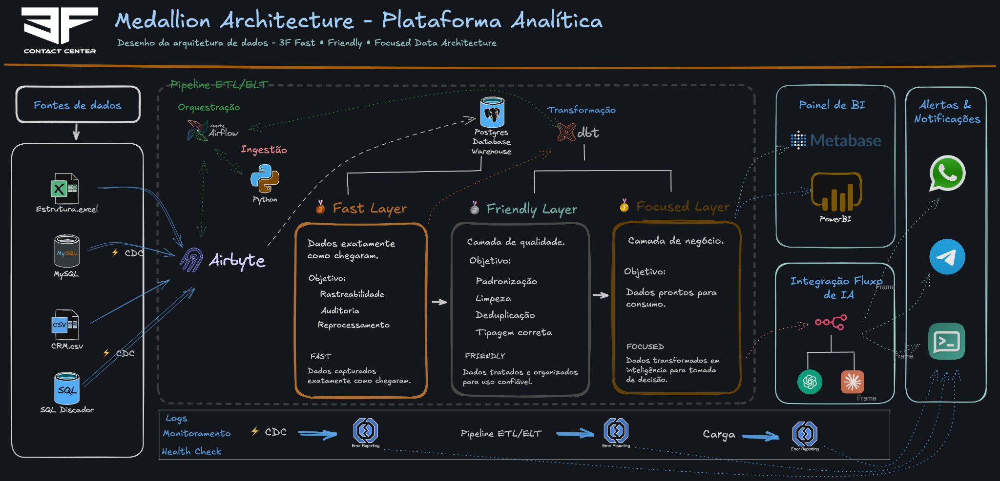
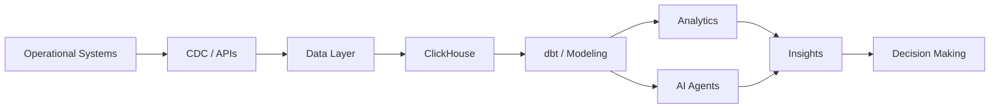

<!-- =========================================================
     RONALDO RAFAEL — GITHUB PROFILE
     github.com/rrfj10
========================================================= -->

<p align="center">
  
</p>

<br>

<h1 align="center">👋 Olá, eu sou Ronaldo Rafael</h1>

<h3 align="center">Data • AI • Automation • Analytics • Contact Center Technology</h3>

<p align="center">
  Construindo soluções que conectam <strong>dados, inteligência artificial, automação e operações reais.</strong>
</p>

<p align="center">
  <a href="https://github.com/rrfj10">
    
  </a>
  
</p>

---

## 🚀 Sobre mim

Minha atuação está na interseção entre **negócio, tecnologia e operação**.

Trabalho desenvolvendo e estudando soluções para transformar dados operacionais em **informação, automação, inteligência e tomada de decisão**.

Áreas que concentram meu interesse e atuação:

- 📊 Data Analytics & Business Intelligence
- 🤖 Inteligência Artificial aplicada a negócios
- ⚙️ Automação de processos e workflows
- 🗄️ Engenharia e Arquitetura de Dados
- 📞 Contact Center Technology
- 🔌 APIs e Integração de Sistemas
- 🧠 LLMs, AI Agents e Text-to-SQL
- 📈 Dashboards e Analytics
- 🔄 ETL, ELT e CDC
- 🐍 Desenvolvimento Python

> Tecnologia só gera valor quando transforma dados em decisões e decisões em resultados.

---

## 🏆 Arquitetura em destaque

### Medallion Architecture — Plataforma Analítica

Uma arquitetura que desenhei para estruturar uma plataforma analítica com foco em **rastreabilidade, qualidade, padronização e consumo inteligente dos dados**.

O fluxo foi organizado em três camadas:

- 🥉 **Fast Layer** — preserva os dados exatamente como chegaram, com foco em rastreabilidade, auditoria e reprocessamento.
- 🥈 **Friendly Layer** — aplica qualidade, padronização, limpeza, deduplicação e tipagem correta.
- 🥇 **Focused Layer** — transforma os dados em informação pronta para consumo e tomada de decisão.

A arquitetura contempla também ingestão, orquestração, transformação, BI, CDC, monitoramento e integração com IA.

**Stack representada no desenho:**

`Airbyte` • `Apache Airflow` • `Python` • `PostgreSQL` • `dbt` • `Metabase` • `Power BI` • `CDC` • `AI Integration`

<p align="center">
  
</p>

> Dica: mantenha a imagem acima em `assets/medallion-architecture.png`.

---

## 🧠 Minha visão de arquitetura

```text
Operational Systems
        ↓
   CDC / APIs
        ↓
 Ingestion Layer
        ↓
 Raw / Fast Layer
        ↓
 Quality / Friendly Layer
        ↓
 Business / Focused Layer
        ↓
   Analytics & BI
        ↓
     AI Agents
        ↓
 Decision Making
```

Meu interesse está em construir arquiteturas que sejam **simples de operar, auditáveis, escaláveis e úteis para o negócio**.

---

## 🛠️ Tech Stack

### 📊 Data & Analytics

<p>
  
  
  
  
  
  
</p>

### 🤖 Artificial Intelligence

<p>
  
  
  
  
  
</p>

### ⚙️ Automation & Integration

<p>
  
  
  
  
</p>

### 🐍 Backend

<p>
  
  
  
</p>

### 🏗️ Infra & Development

<p>
  
  
  
  
  
</p>

---

## 🔬 Principais áreas de estudo

<table>
<tr>
<td width="50%" valign="top">

### 🤖 AI & Agents

- LLM Applications
- AI Agents
- RAG
- Agentic Analytics
- Text-to-SQL
- Semantic Layers
- Intelligent Reporting
- AI-powered Dashboards

</td>
<td width="50%" valign="top">

### 🗄️ Data Engineering

- Data Modeling
- ETL / ELT
- CDC
- ClickHouse
- DuckDB
- dbt
- Data Warehousing
- Analytical Architecture

</td>
</tr>

<tr>
<td width="50%" valign="top">

### ⚙️ Automation

- n8n
- APIs
- Webhooks
- Workflow Automation
- Python Automation
- System Integration
- Process Orchestration

</td>
<td width="50%" valign="top">

### 📊 Analytics

- Operational Analytics
- Business Intelligence
- KPI Modeling
- Dashboards
- Data Visualization
- Performance Analytics
- Decision Intelligence

</td>
</tr>
</table>

---

## 📞 Contact Center Analytics

Uma das áreas onde aplico tecnologia e dados é **Contact Center**.

```text
Mailing
  ↓
Lead
  ↓
Discagem
  ↓
Tentativas
  ↓
Alô
  ↓
CPC
  ↓
Proposta
  ↓
Venda
  ↓
Conversão
```

Indicadores que fazem parte desse universo:

- Produtividade
- Conversão
- CPC
- Taxa de contato
- Tentativas por lead
- Aproveitamento de mailing
- Performance de telefonia
- Performance por operador
- Performance por supervisor
- Qualidade da base
- Funil comercial

---

## 🤖 AI + Analytics

Uma das áreas que mais exploro é a evolução do modelo tradicional:

```text
Database
   ↓
SQL
   ↓
Dashboard
```

para arquiteturas mais inteligentes:

```text
Database
   ↓
Semantic Layer
   ↓
LLM / AI Agent
   ↓
SQL Generation
   ↓
Data Analysis
   ↓
Insights
   ↓
Dynamic Dashboard
```

Exemplo de pergunta analítica:

> Qual indicador explica a maior queda de conversão nos últimos dias e onde devo atuar primeiro?

Um sistema inteligente deve ser capaz de:

```text
Entender a pergunta
        ↓
Identificar métricas
        ↓
Consultar os dados
        ↓
Validar o resultado
        ↓
Criar a análise
        ↓
Explicar os fatores
        ↓
Apresentar visualmente
```

---

## ⚙️ Automation Lab

Soluções combinando:

```text
n8n
+
APIs
+
Webhooks
+
Python
+
LLMs
```

para integração de sistemas, automação de processos e redução de tarefas repetitivas.

---

## 🗄️ Modern Data Architecture



---

## 🚧 Labs & Projetos

### 🤖 `ai-dashboard-lab`
Experimentos para geração e interpretação de dashboards utilizando inteligência artificial.

### 📊 `contact-center-analytics`
Modelos analíticos, indicadores e estudos voltados para operações de Contact Center.

### 🗄️ `data-engineering-lab`
Experimentos com `DuckDB`, `ClickHouse`, `dbt`, `CDC`, `ETL` e `ELT`.

### ⚙️ `n8n-automation-lab`
Workflows, automações, webhooks e integrações utilizando n8n.

### 🧠 `text-to-sql-lab`
Experimentos combinando linguagem natural, LLMs, SQL e bancos de dados.

### 🐍 `python-data-toolbox`
Scripts e ferramentas Python para processamento, transformação e análise de dados.

---

## 🎯 Atualmente explorando

`AI Agents` • `Agentic Analytics` • `LLM Applications` • `Text-to-SQL` • `RAG` • `AI-powered Dashboards` • `Semantic Layers` • `ClickHouse` • `DuckDB` • `dbt` • `CDC` • `Data Modeling` • `Modern Data Stack` • `Workflow Automation` • `Data Architecture`

---

## 📊 GitHub Analytics

<p align="center">
  
  
</p>

---

## 🔥 GitHub Streak

<p align="center">
  
</p>

---

## 📈 Contribution Activity

<p align="center">
  
</p>

---

## 💡 Engenharia aplicada ao mundo real

```text
Problema operacional
        ↓
Entendimento do processo
        ↓
Dados
        ↓
Engenharia
        ↓
Automação
        ↓
Inteligência
        ↓
Resultado
```

Nem todo problema precisa de IA.

Nem todo problema precisa de uma arquitetura complexa.

A melhor tecnologia é aquela que resolve o problema de forma **simples, confiável, escalável e mensurável**.

---

<div align="center">

## Build. Measure. Learn. Automate. 🚀

### Turning operational complexity into intelligent systems.

**Data • AI • Automation • Real-world Operations**

<br>

<a href="https://github.com/rrfj10">
  
</a>

</div>
